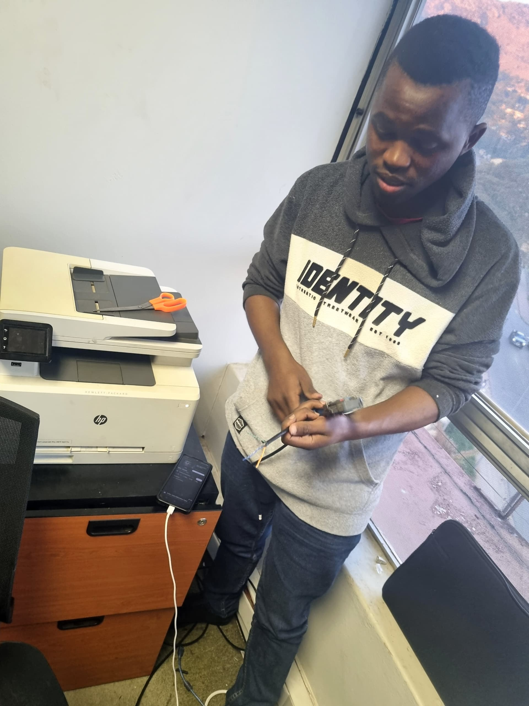

# Makabongwe Simelane - Personal Website

A modern, responsive, professional personal website built with **pure HTML, CSS, and JavaScript** (no frameworks or libraries).

## 🎯 Overview

This website showcases Makabongwe Simelane's portfolio as a Computer Science student at Eswatini College of Technology. It features:

- **Multi-page navigation** with smooth transitions
- **Responsive design** that works on desktop, tablet, and mobile
- **Professional color palette** with modern aesthetic
- **Interactive elements** with hover effects and animations
- **Contact form** with validation
- **Accessibility-first** approach

## 📁 Folder Structure

```
website/
├── index.html              # Home page
├── about.html              # About Me page
├── background.html         # Background & Personal Life page
├── hobbies.html           # Hobbies & Interests page
├── contact.html           # Contact page
├── css/
│   └── styles.css         # Main stylesheet (all CSS)
├── js/
│   └── script.js          # JavaScript functionality
├── images/
│   └── profile.jpg        # Profile picture (placeholder)
└── README.md              # This file
```

## 🎨 Color Palette

The website uses a professional, tech-focused color scheme:

| Color | Hex Code | Usage |
|-------|----------|-------|
| Primary Navy | `#0F172A` | Main background, text |
| Modern Blue | `#2563EB` | Buttons, links, accents |
| Light Blue | `#38BDF8` | Highlights, hover effects |
| Light Background | `#F8FAFC` | Card backgrounds |
| Dark Text | `#1E293B` | Main text content |
| Light Text | `#64748B` | Secondary text |

## 📄 Pages Overview

### 1. **Home (index.html)**
- Hero section with introduction
- Profile picture with floating animation
- Overview cards highlighting education, passion, background, and vision
- Featured technical focus areas
- Call-to-action section

### 2. **About Me (about.html)**
- Introduction and background
- Academic foundation details
- Problem-solving approach
- Continuous learning philosophy
- Core values section
- Long-term vision

### 3. **Background & Personal Life (background.html)**
- Geographic and cultural background (Eswatini, Nhlangano)
- Extended family upbringing
- Sibling dynamics and family structure
- Values shaped by background (respect, cooperation, responsibility, adaptability)
- Personal growth journey

### 4. **Hobbies & Interests (hobbies.html)**
- Technology exploration
- Web development and system design interests
- Problem-solving challenges
- Continuous learning commitment
- Technology culture (AI, hacking, futuristic systems)
- Work style and mindset

### 5. **Contact (contact.html)**
- Contact information (email, phone, location, LinkedIn, GitHub)
- Functional contact form with validation
- Why connect section
- Social media links

## 🚀 Getting Started

### Prerequisites
- A modern web browser (Chrome, Firefox, Safari, Edge)
- XAMPP or any local web server

### Installation & Running Locally

#### **Option 1: Using XAMPP (Recommended)**

1. **Place files in XAMPP directory:**
   ```powershell
   # Copy the entire website folder to XAMPP
   Copy-Item -Path "c:\xampp\htdocs\website" -Destination "c:\xampp\htdocs\" -Recurse
   ```

2. **Start XAMPP:**
   - Open XAMPP Control Panel
   - Click "Start" next to Apache

3. **Open in browser:**
   - Navigate to: `http://localhost/website/index.html`

#### **Option 2: Direct File Access**

1. **Navigate to the website folder:**
   ```powershell
   cd c:\xampp\htdocs\website
   ```

2. **Open index.html in your browser:**
   - Double-click `index.html` file, OR
   - Right-click → Open With → Choose your browser

#### **Option 3: Using Python Simple Server**

1. **Open PowerShell in the website directory:**
   ```powershell
   cd c:\xampp\htdocs\website
   ```

2. **Start Python server:**
   ```powershell
   # Python 3
   python -m http.server 8000
   # Or if that doesn't work
   py -m http.server 8000
   ```

3. **Open browser:**
   - Navigate to: `http://localhost:8000/`

## 🖼️ Profile Picture Setup

### Using Placeholder
The website currently uses `images/profile.jpg` as a placeholder. 

### Replacing with Your Photo

1. **Prepare your image:**
   - Format: JPG, PNG, or WebP
   - Recommended size: 300x350px or larger
   - Name: `profile.jpg` (or your preferred name)

2. **Place the image:**
   - Copy your image to the `images/` folder
   - Rename it to `profile.jpg`

3. **Alternative file name:**
   If you want to use a different filename:
   - Edit these files and replace `images/profile.jpg`:
     - `index.html` (line ~65)
     - `about.html` (line ~58)
     - `background.html` (also used in content)

   Example:
   ```html
   <!-- Change from: -->
   
   
   <!-- To: -->
   
   ```

## 🎨 Customization Guide

### Changing Colors

Edit `css/styles.css` to modify the color palette:

```css
:root {
    --primary-color: #0F172A;      /* Dark Navy */
    --secondary-color: #2563EB;    /* Modern Blue */
    --accent-color: #38BDF8;       /* Light Blue */
    --bg-light: #F8FAFC;           /* Light Background */
    --text-dark: #1E293B;          /* Dark Text */
    /* ... other colors ... */
}
```

### Changing Content

All text content is in the HTML files. Simply edit any `.html` file to update content:

```html
<!-- Edit text directly in HTML files -->
<h1>Your New Title</h1>
<p>Your new content here</p>
```

### Changing Fonts

Google Fonts are used. To change fonts:

1. Visit: https://fonts.google.com
2. Select fonts you like
3. Copy the import link
4. Replace in HTML files (line with `<link href="..."`)
5. Update font-family in `css/styles.css`

## ✨ Features

### Responsive Design
- **Desktop:** Full layout optimization
- **Tablet:** Optimized grid layouts
- **Mobile:** Single column layout, hamburger menu

### Interactive Elements
- ✅ Smooth navigation with active state highlighting
- ✅ Mobile hamburger menu
- ✅ Hover effects on buttons and cards
- ✅ Form validation on contact page
- ✅ Scroll animations for elements
- ✅ Smooth scrolling behavior

### Modern Styling
- ✅ Professional color scheme
- ✅ Subtle shadows and rounded corners
- ✅ Consistent spacing and alignment
- ✅ Smooth CSS transitions
- ✅ Responsive typography

### Accessibility
- ✅ Semantic HTML structure
- ✅ Alt text on images
- ✅ Clear form labels
- ✅ High contrast ratios
- ✅ Keyboard navigation support

## 📱 Browser Compatibility

| Browser | Support |
|---------|---------|
| Chrome 90+ | ✅ Full Support |
| Firefox 88+ | ✅ Full Support |
| Safari 14+ | ✅ Full Support |
| Edge 90+ | ✅ Full Support |
| IE 11 | ⚠️ Limited Support |

## 🔧 File Descriptions

### HTML Files
- **index.html** - Landing page with hero section and overview
- **about.html** - Detailed about page with background and vision
- **background.html** - Personal background and family information
- **hobbies.html** - Interests, hobbies, and technology passion
- **contact.html** - Contact information and message form

### CSS
- **styles.css** - Complete styling (1000+ lines)
  - Root variables for colors and spacing
  - Component styles
  - Responsive breakpoints
  - Animations and transitions

### JavaScript
- **script.js** - All interactivity
  - Navigation menu toggle
  - Form validation and submission
  - Scroll animations
  - Utility functions
  - Error handling

## 🎯 Contact Form Notes

The contact form includes:
- ✅ Real-time validation
- ✅ Email format checking
- ✅ Required field validation
- ✅ Success/error notifications
- ✅ Form reset after submission

**Note:** Form currently shows success message locally. For production use, integrate with a backend service like:
- Formspree
- EmailJS
- Your own backend API

## 📊 Performance Optimization

This website is optimized for:
- **Fast loading** - No dependencies or frameworks
- **Small file size** - Lightweight CSS and JavaScript
- **Mobile performance** - Responsive images and lazy loading ready
- **SEO friendly** - Semantic HTML structure

## 🐛 Troubleshooting

### Profile Picture Not Showing
1. Check file exists at `images/profile.jpg`
2. Verify correct file path in HTML
3. Check file permissions
4. Try different image format (PNG, WebP)

### Styles Not Applied
1. Clear browser cache (Ctrl+Shift+Delete)
2. Hard refresh (Ctrl+F5)
3. Check CSS file path in HTML `<link>` tag
4. Verify `css/styles.css` file exists

### Navigation Menu Not Working
1. Check JavaScript is enabled
2. Open browser console (F12)
3. Look for JavaScript errors
4. Verify `js/script.js` file exists

### Form Not Submitting
1. Check browser console for errors
2. Verify all form fields are filled
3. Check email format is valid
4. Ensure JavaScript is enabled

## 🔐 Security

This website uses:
- ✅ No external dependencies (secure)
- ✅ Client-side form validation
- ✅ No sensitive data collection
- ✅ HTTPS recommended for production

## 📈 Future Enhancement Ideas

- Add project portfolio section
- Integrate with LinkedIn API
- Add blog functionality
- Implement dark mode toggle
- Add multi-language support
- Setup contact form backend integration
- Add analytics tracking
- Create downloadable resume/CV

## 📝 License

This personal website is created for Makabongwe Simelane. Feel free to customize and use as your own portfolio.

## 👤 About the Website

**Owner:** Makabongwe Simelane  
**Position:** Computer Science Student (Year 2)  
**Institution:** Eswatini College of Technology  
**Location:** Eswatini  
**Built:** January 2026

---

## 📞 Support

For questions or issues:
1. Check the troubleshooting section
2. Review HTML/CSS/JavaScript files (well-commented)
3. Check browser console (F12) for errors
4. Ensure all files are in correct folders

---

**Enjoy your personal website! 🚀**

Happy coding and best of luck with your Computer Science journey!
